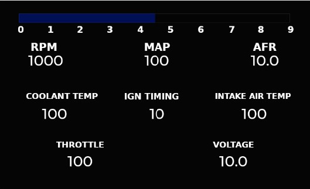
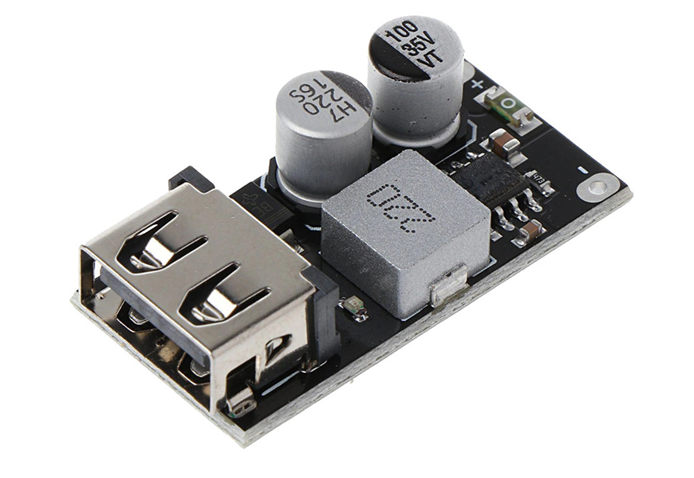
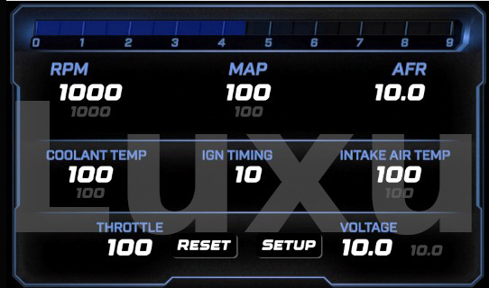
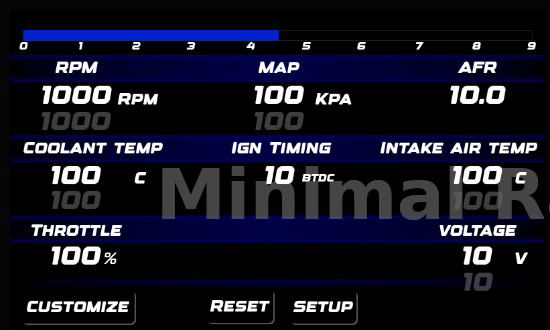

# Megasquirt / Microsquirt 7" LCD Digital Dashboard - DIY under $50

A low-cost 7 inch digital racing dashboard solution for Megasquirt and Microsquirt ECUs, displaying real-time ECU parameters through CAN Bus.

  

---

# Introduction

Have you ever looked at modern racing LCD dashboards and thought:

*"I wish I could afford one..."*

Professional motorsport dashboards are amazing, but they are usually very expensive.

This project provides a cheap alternative:
a fully functional digital LCD dashboard capable of displaying ECU data in real time, without needing a laptop inside the car.

After years of development, testing, and many prototype boards, this is the result:
a reliable 7 inch touchscreen dashboard solution running on real vehicles.

The firmware has been tested extensively and is currently running on **20+ cars**.

The dashboard communicates with the ECU through CAN Bus and is designed specifically for Megasquirt / Microsquirt systems.

> If you prefer a smaller display, check my 5 inch version:
> 
> https://github.com/somahex00-web/Megasquirt-Microsquirt-digital-dashboard-for-under-50-DIY

---

# Demo Video

Free version demonstration:

https://youtu.be/rjETbBOaq9w

The video shows the dashboard receiving simulated CAN Bus data.

---

# Required Hardware

You need:

- ESP32-S3 7 inch Touch LCD
- USB Type-C data cable
- Megasquirt / Microsquirt ECU

Recommended display:

Waveshare ESP32-S3 Touch LCD 7 inch (800x480)

Purchase link:

https://www.waveshare.com/esp32-s3-touch-lcd-7.htm?&aff_id=155489

(Using my link helps support the development of this project.)

---

# Installing the Free Firmware

## 1. Download Firmware

Download the free firmware:

https://github.com/somahex00-web/Megasquirt-Microsquirt-7-LCD-digital-dashboard-for-under-50-DIY-/blob/main/Dash_Micro_LCD7_Free.bin

---

## 2. Connect the Display

Connect the ESP32-S3 display to your PC using a USB Type-C data cable.

---

## 3. Flash the Firmware

Open:

https://esptool.spacehuhn.com/

Select your ESP32 device from the available COM ports.

The board should appear as:

ESP32

If the device does not connect:

1. Hold the BOOT button
2. Hold the RESET button
3. Keep both pressed for around 2 seconds
4. Release RESET
5. Wait 1 second
6. Release BOOT

The device should now connect.

---

## 4. Flash Settings

Select:

LCD_DASH_7Inch_FREE.bin

Flash address:

0x0000

Visual flashing guide:

https://github.com/somahex00-web/Megasquirt-Microsquirt-7-LCD-digital-dashboard-for-under-50-DIY-/blob/main/How%20to%20flash.pdf

After flashing:

- Press RESET
or
- Disconnect and reconnect USB

The dashboard should start.

---

# CAN Bus Termination

Important:

On the back of the display board there is a selector to enable the CAN Bus termination resistor.

If your CAN network only contains:

ECU + Dashboard

enable the termination resistor.

If you have other CAN Bus devices:

Measure resistance between:

CAN-H and CAN-L

Expected values:

60 Ohm → Correct termination
120 Ohm → Only one termination present

If you measure 120 Ohm, enable the termination switch on the dashboard board.

---

# Power Supply Installation

To power the dashboard from vehicle voltage, you need a:

12-24V to 5V Buck Converter like this one:

  

Recommended setup:

- Install the buck converter in the vehicle
- Use its USB output
- Power the dashboard using a normal USB cable

This configuration has proven to be the most reliable solution, with zero failures reported so far.

---

# Microsquirt Wiring

Complete installation guide:

https://github.com/somahex00-web/Megasquirt-Microsquirt-7-LCD-digital-dashboard-for-under-50-DIY-/blob/main/Dashboard%20for%20microsquirt%20installation%20guide%20-%207%20inch%20dash%20ENG%20071125.pdf

---

# Features

- 7 inch 800x480 touchscreen display
- CAN Bus ECU communication
- Megasquirt / Microsquirt compatibility
- Real-time ECU parameters
- Custom racing dashboard graphics
- Multiple layouts and backgrounds
- Standalone operation
- No laptop required
- Low-cost hardware

---

# Gallery

example of licensed version design:

  

  

Many others available.

---

# Dashboard Designs & Backgrounds

Catalogue:

https://github.com/somahex00-web/Megasquirt-Microsquirt-7-LCD-digital-dashboard-for-under-50-DIY-/blob/main/Catalogue.pdf

More graphics and examples:

YouTube channel:

https://www.youtube.com/@alfredodimatteo2850

Latest dashboard version:

https://www.youtube.com/watch?v=xfOAbD9B4jw

---

# Premium License

The free firmware allows you to test the hardware and basic dashboard functions.

The premium licensed software price is:

75 Euro

This contribution supports:

- New dashboard designs
- Development tools
- Hardware testing
- Future improvements

---

# How to Purchase

1. Flash the free firmware
2. Boot the dashboard
3. Click the bottom-right corner of the screen
4. Copy your unique license code

Send the license code through:

https://somahex00.wixsite.com/home/contact

You will receive a custom firmware file generated specifically for your board.

Each license is hardware-bound:

- Works only on your device
- Cannot be copied to other boards
- Prevents license sharing

---

# Support & Updates

Development updates, new graphics and examples:

https://www.youtube.com/@alfredodimatteo2850

---

Made with passion for DIY motorsport electronics.
